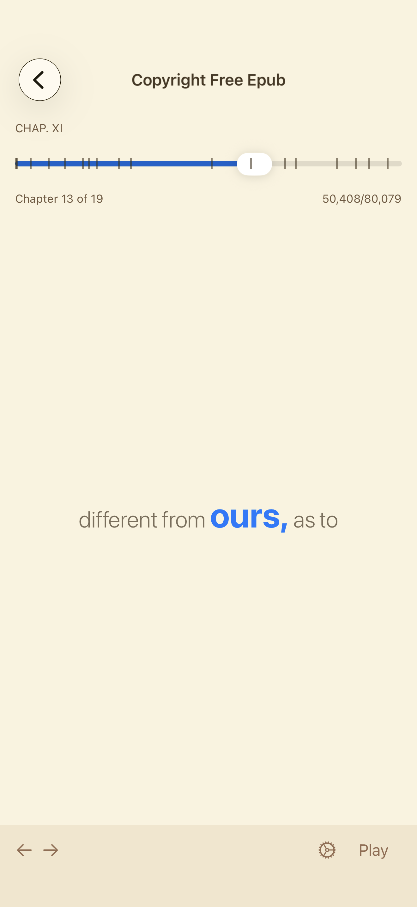
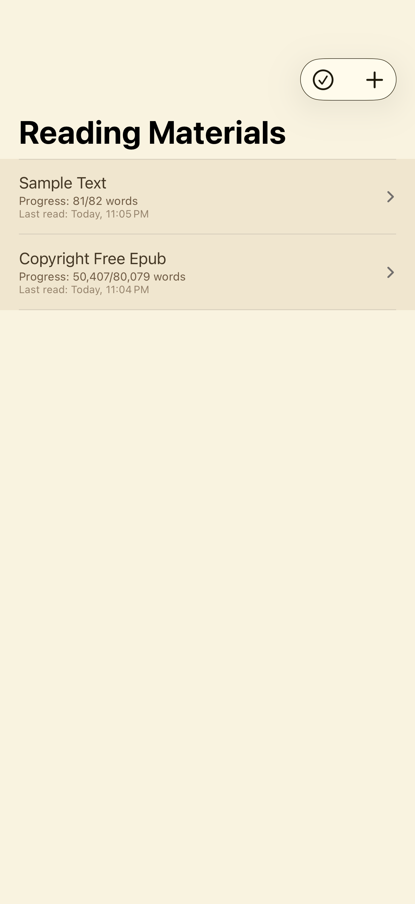
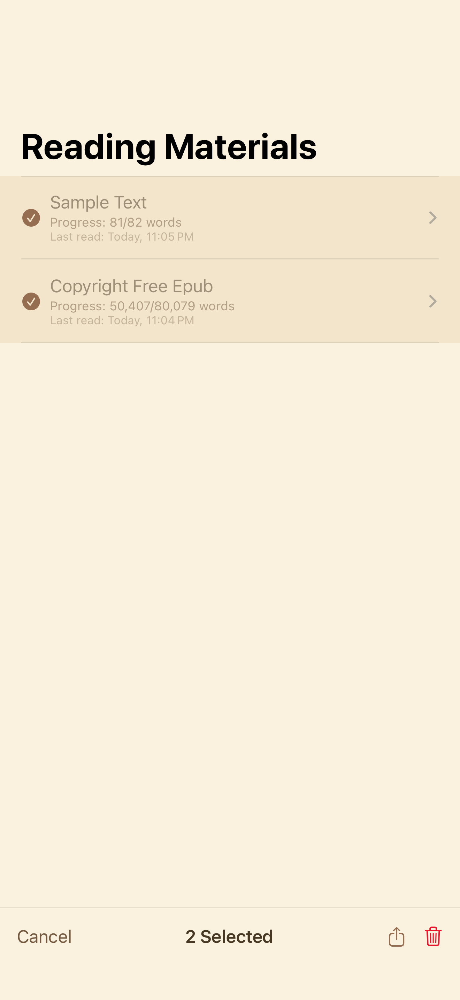
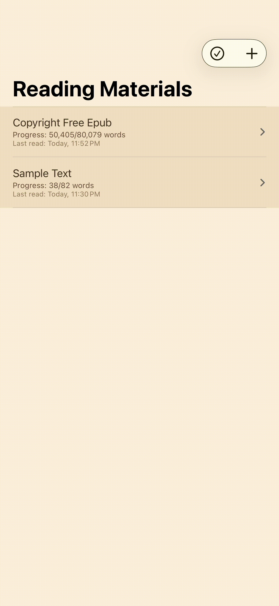
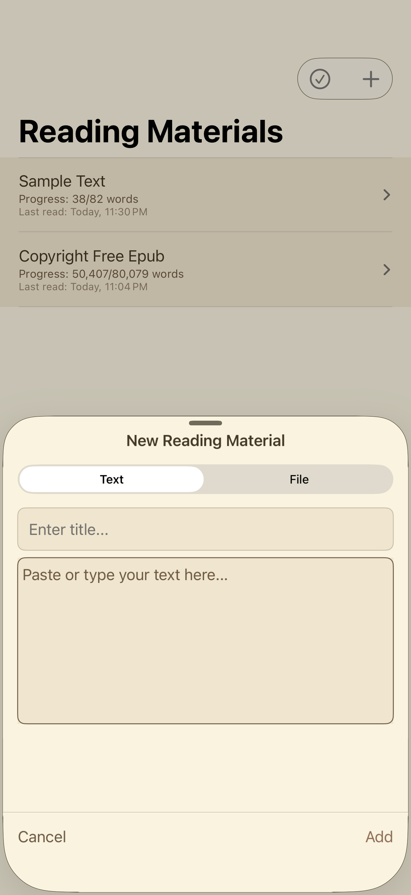
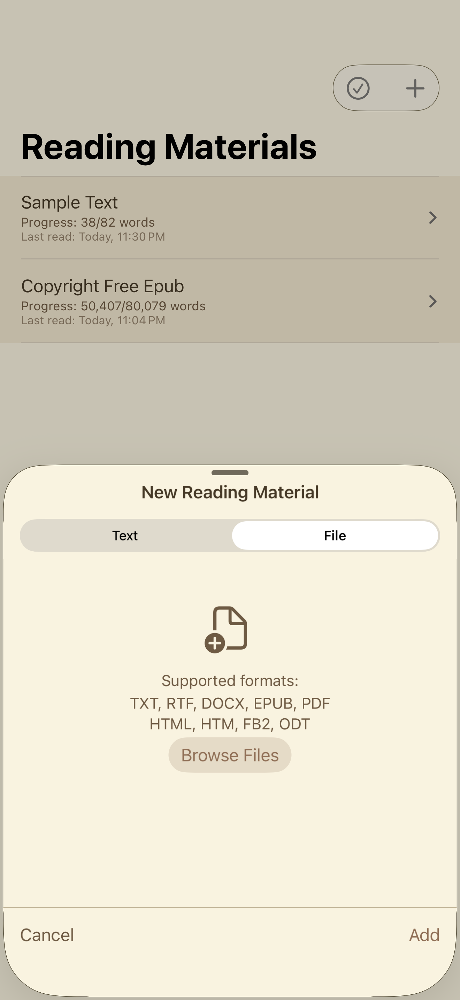
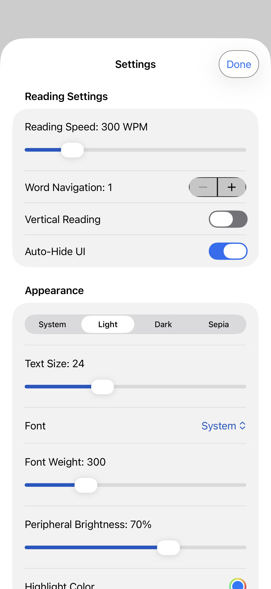
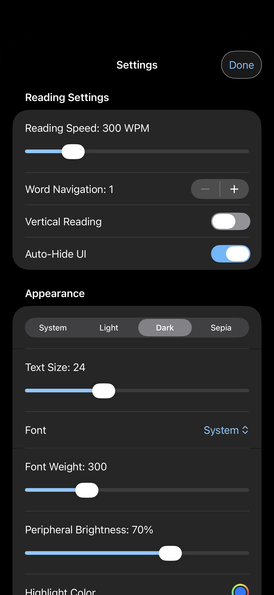
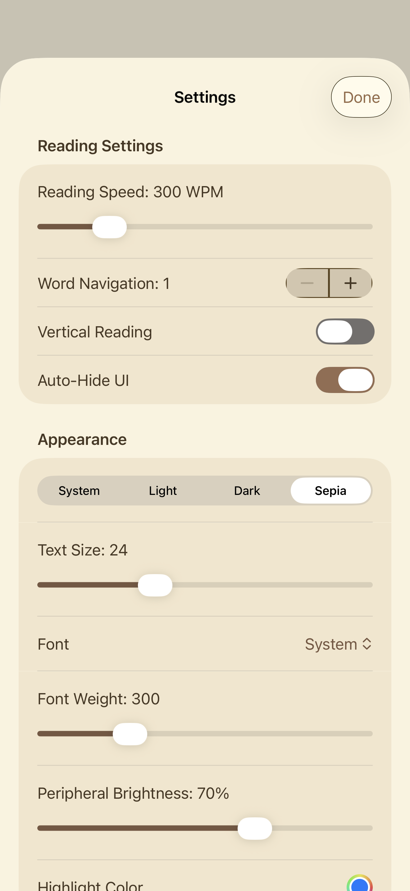
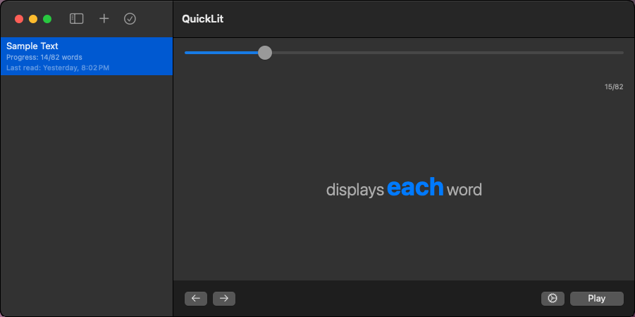

#  QuickLit - RSVP Reading App
"*The Quicker <small>Word</small> Picker Upper*"


https://github.com/user-attachments/assets/a81a5b35-fcaf-41dd-81b4-36c3a930973f


*A modern cross-platform reading application built with SwiftUI that implements Rapid Serial Visual Presentation (RSVP) technology to enhance reading speed and comprehension.*

 

## 🚀 Features
### Core Reading Experience
- **RSVP Technology**: Display words one at a time in focused central position
- **Speed Customization**: Adjustable reading speed from 50-600 words per minute
- **Multiple Layouts**: Horizontal and vertical reading modes
- **Progress Tracking**: Real-time progress indicators and navigation


   

*Customizable reading experience with precise speed control*

### Content Management
- **Multi-Format Support**: TXT, RTF, DOCX, EPUB, PDF, HTML, FB2, ODT
- **Flexible Input**: Direct text input or file import
- **Material Organization**: Library with search, selection, and batch operations

 

*Organized library with progress tracking and batch operations*

### Customization
- **Visual Themes**: System, Light, Dark, and Sepia modes with automatic adaptation
- **Typography**: Multiple fonts with adjustable size, weight, and spacing
- **Accessibility**: VoiceOver support and Dynamic Type compatibility

  

*Multiple visual themes with seamless system integration*

## 📚 EPUB Chapter Support

One of QuickLit's standout features is **intelligent EPUB chapter detection and navigation**. The app automatically:

- **Extracts chapter structure** from EPUB files with precise word position tracking
- **Smart title detection** using multiple strategies to identify meaningful chapter titles
- **Navigation elements filtering** automatically skips TOC, copyright, and other non-content sections
- **Continuation file handling** seamlessly combines split chapters from poorly formatted EPUBs

### Advanced Chapter Detection
The system employs sophisticated heuristics to identify chapters:

```swift
// Multiple title detection strategies
1. CSS class patterns (.chapter-title, .chapter, etc.)
2. Numbered chapter patterns (CHAPTER 1, Prologue, etc.)
3. Heading hierarchy analysis (h1, h2, h3)
4. EPUB semantic sections (section[epub:type='chapter'])
5. Filename fallback when metadata is missing
```
### Smart Filtering
- Skips navigation elements: Table of Contents, copyright pages, color inserts
- Identifies continuation files: Automatically appends split chapters
- Removes duplicate titles: Prevents chapter title repetition in extracted text
  
This sophisticated EPUB processing ensures readers get clean, properly structured content with accurate chapter navigation for an optimal reading experience.

## 🛠 Technical Implementation

### Architecture
- **SwiftUI**: Modern declarative UI framework
- **SwiftData**: Persistent storage with automatic sync
- **MVVM Pattern**: Clean separation of business logic and presentation
- **Cross-Platform**: Single codebase for iOS and macOS


*Clean architecture with clear separation of concerns*

*Unified file processing system supporting 8+ document formats*

### Technical Highlights
- **Universal File Processing**: Custom parsers for complex formats like EPUB and DOCX
- **Performance Optimization**: Efficient text rendering and memory management
- **Gesture Navigation**: Intuitive swipe controls for word navigation
- **Theme System**: Dynamic color adaptation across entire application

*Seamless file import with drag & drop support*

## 🎯 User Experience

### Focused Reading
- **Minimal Interface**: Clean design eliminates distractions
- **Center Word Highlighting**: Natural focus point reduces eye movement
- **Peripheral Context**: Surrounding words provide reading flow


### Intuitive Interaction
- **Swipe Navigation**: Gesture controls for forward/backward movement
- **Progress Visualization**: Clear indicators show reading position
- **One-Tap Controls**: Play/pause and speed adjustment


### Cross-Platform Consistency
- **Unified Design**: Consistent experience across iOS and macOS
- **Platform Optimized**: Native controls and interactions
- **Seamless Sync**: Reading progress maintained across devices




## 🚀 Getting Started

### Requirements
- iOS 18.5+
- macOS 15.5+

*Clean project structure with modular organization*

## 📊 Technical Details

- **10,000+ lines** of Swift code demonstrating modern iOS/macOS development practices
- **8 file formats** supported through custom parsing implementations
- **Cross-platform architecture** with 90%+ code sharing between iOS and macOS
- **Comprehensive accessibility** features following Apple's guidelines
- **Performance optimized** for smooth reading experience with large documents

*Optimized performance for smooth reading experience*

## 🔧 Test Coverage
The app includes a comprehensive test suite with extensive test cases covering core functionality:

- SupportedFormatTests: File format detection and text extraction for all 8 supported formats

- ReadingMaterialTests: Data model validation and word count calculations

- AppSettingsTests: User preferences, theme system, and default value restoration

- ReadingViewModelTests: RSVP reading engine, navigation, and progress tracking

- FileImportTests: File import workflow and validation

- ContentViewTests: UI integration and material management

